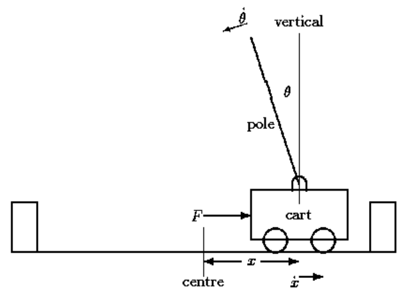

# Deep Reinforcement Learning for Cartpole
For this lab, we will apply deep reinforcement learning to solve a popular benchmark problem in classic control theory. Consider a cart (Figure 1) confined on a frictionless track with a pole
attached on an unactuated revolute joint. The system is initialized with the pole standing upright and the goal is to prevent it from falling over. At every time instant, we can observe both the cart position x (w.r.t. the centre) and pole angle θ as well as their derivatives. Furthermore, a force of magnitude 1N can be applied on either side of the cart.

  

  Figure 1: The cart and pole system.

We wish to train an agent to find the optimal policy that achieves this goal. To this end, we set up an episodic Reinforcement Learning (RL) problem where the agent receives a reward r_t = 1 for
every time step that θ is kept within 12.5 degrees from the vertical position and the magnitude of x is less than 2.4m. The agent receives r_t = 0 otherwise. The episode terminates after 200 time steps or once the agent receives 0 reward for the first time.

**(a)** Formulate the RL problem (state-space, action-space, etc.). Can you use standard RL methods to solve it? Why would you consider deep RL?

**(b)** Familiarize yourself with the code. Provide a brief description outlining the steps taken in main as well as the behavior of each function.

**(c)** Write pseudo-code for DQN and explain it line by line. Associate your pseudo-code line numbers with corresponding (and potentially missing) parts of the code provided to you. As our training environment, we will use the CartPole-v0 simulator which is part of the gym library; a reinforcement learning research platform provided by OpenAI. We also provide you with the file cartpole dqn.py which contains an incomplete implementation of DQN.

**(d)** Consult the Keras documentation and briefly explain the layout of the given neural network model. Note that we use a network which takes only the state as input and outputs the Q values for each action at that state.

**(e)** Fill your ε-greedy policy code in the get action function.

**(f)** Complete the train model function by filling in the computation of the target value.

**(g)** Assess the impact of the model on training. Try increasing the number of neurons (nodes) and document their impact on the agent’s performance. Is there a benefit to increasing the
number of hidden layers? Note that you may have to adjust some of the hyperparameters referred to below in order to observe significant differences.

**(h)** Once you are satisfied with your model, investigate the effect of the discount factor, learning rate, and memory size on learning performance. Document your findings with three representative simulations per parameter.

**(i)** The variable target update frequency controls how often the target network is updated (measured in episodes). Investigate its impact on training and document it with three representative simulations.

**(j)** Based on the above, choose an appropriate set of hyperparameters and model. In the code, set the variable self.check solve to True and verify that you indeed solve the problem. The
problem is considered solved when the average reward over 100 consecutive episodes is greater than or equal to 195.

